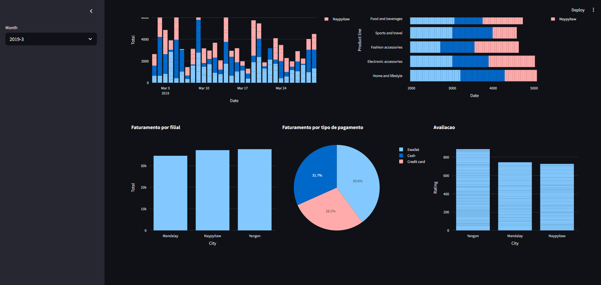

# Dashboard Interativo de Vendas de Supermercado

Este repositório contém um dashboard interativo desenvolvido em Python utilizando Streamlit, Pandas e Plotly. O objetivo do projeto é analisar e visualizar dados de vendas de um supermercado, permitindo a seleção dinâmica de meses e a visualização de diferentes métricas de faturamento.

## Descrição do Projeto

O dashboard permite:
- Selecionar o mês de análise via barra lateral.
- Analisar o faturamento por tipo de produto.
- Comparar o faturamento total por filial (cidade).
- Ver a distribuição do faturamento por tipo de pagamento.
- Avaliar a média de avaliação dos clientes por cidade.

## Tecnologias Utilizadas

- [Python](https://www.python.org/)
- [Pandas](https://pandas.pydata.org/)
- [Streamlit](https://streamlit.io/)
- [Plotly Express](https://plotly.com/python/plotly-express/)

